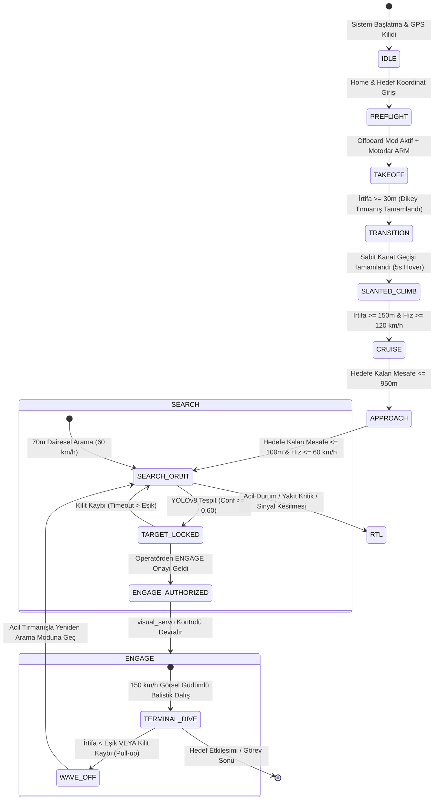
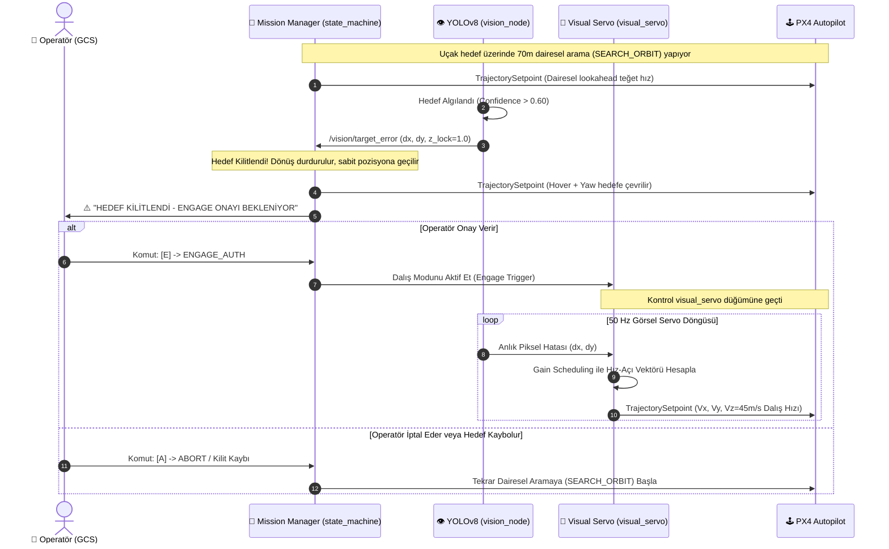
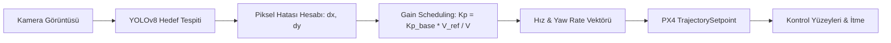

<p align="center">
  
  
  
  
  
  
</p>

<h1 align="center">🛩️ VTOL Autonomy Stack</h1>
<h3 align="center">High-Assurance Autonomous Flight Control & Visual Servoing for Tactical Loitering Munitions</h3>

<p align="center">
  <b>Taktik Dikey Kalkışlı Sabit Kanat (VTOL) Dolanan Mühimmat Tam Otonom Görev ve Güdüm Sistemi</b><br/>
  <i>ROS 2 Humble · PX4 Offboard Control · YOLOv8 Computer Vision · Circular Orbit Tracking · Visual Servoing Precision Dive</i>
</p>

<p align="center">
  <a href="#-system-overview">Overview</a> •
  <a href="#-system-architecture">Architecture</a> •
  <a href="#-flight-state-machine-fsm">State Machine</a> •
  <a href="#-mission-sequence-diagram">Mission Sequence</a> •
  <a href="#-guidance--control-theory">Guidance Theory</a> •
  <a href="#-ground-control-station-gcs">GCS Terminal</a> •
  <a href="#-installation--build">Installation</a> •
  <a href="#-quickstart--simulation">Quickstart</a> •
  <a href="#-parameters">Configuration</a>
</p>

---

## 🔭 System Overview / Genel Bakış

**VTOL Autonomy Stack**, dikey kalkış-iniş (VTOL) yapabilen hibrit sabit kanatlı taktik İHA'lar ve dolanan mühimmatlar (loitering munitions / kamikaze İHA) için geliştirilmiş, endüstriyel standartlarda bir **ROS 2** otonomi yazılımıdır. 

Sistem; pist gerektirmeyen dikey kalkıştan başlayarak, döner kanattan sabit kanada geçişi, yüksek hızlı intikali, hedef alanı üzerinde aerodinamik olarak ölçeklenen dairesel devriyeyi (orbit loiter), yapay zeka tabanlı hedef tespitini ve hedefe kilitlenip terminal görsel servo dalışını (precision kamikaze dive) **Human-in-the-Loop (HITL)** güvenlik mimarisiyle icra eder.

### 🌟 Key Engineering Highlights / Mühendislik Özellikleri

| Yetenek | Teknik Karşılığı | Avantajı |
|---|---|---|
| **Pist Bağımsız Operasyon** | Multikopter VTOL Modu ($Z$-hız kontrollü tırmanış) | Zorlu arazi şartlarında fırlatıcı/katapult gerektirmeden görev icrası |
| **Tam Otonom Geçiş** | PX4 Native Transition State senkronizasyonu | Aerodinamik kaldırma kuvveti oluşana kadar güvenli geçiş |
| **Yüksek Hızlı İntikal** | 3D Hibrit Pozisyon + Hız Vektörü ($200\text{ km/h}$) | Rüzgar sürüklenmelerini kompanse eden hassas hedef intikali |
| **Dinamik Yörünge (Orbit)** | $R = \frac{V^2}{g \cdot \tan(\phi)}$ Aerodinamik Model | Yapısal g-limitlerini aşmadan hıza göre otomatik yarıçap ölçekleme |
| **AI Optik Kilitlenme** | Ultralytics YOLOv8 ($30\text{ FPS}$, $<30\text{ ms}$ gecikme) | Gerçek zamanlı zırhlı araç / hedef tespiti ve piksel hata kestirimi |
| **HITL Güvenlik Doktrini** | Operatör Yetkilendirme Protokolü (`ENGAGE_AUTH`) | İstenmeyen sivil/dost unsurlara taarruzu engelleyen nihai insan onayı |
| **Görsel Güdüm (Dive)** | Gain-Scheduled $P$-Controller ($50\text{ Hz}$ servo döngüsü) | Yüksek hızda kontrol yüzeyi aşırı tepkilerini engelleyen dinamik kazanç |

---

## 🏗 System Architecture / Sistem Mimarisi

Sistem, **Companion Computer (Görev Bilgisayarı)**, **PX4 Otopilot (Uçuş Kontrolcüsü)** ve **Yer Kontrol İstasyonu (GCS)** olmak üzere üç katmanlı dağıtık bir topolojiye sahiptir:

```mermaid
flowchart TB
    subgraph GCS[" 🖥️ YER KONTROL İSTASYONU (GCS) "]
        direction TB
        GCS_UI["gcs_panel.py<br/>(Curses Taktik Arayüz / HUD)"]
        GCS_BRIDGE["gcs_listener.py<br/>(Watchdog & Koordinat Doğrulama)"]
        GCS_UI <-->|ROS 2 IPC| GCS_BRIDGE
    end

    subgraph TELEMETRY[" 📡 TELEMETRİ / DATA LINK (WiFi / RF) "]
        LINK["ROS 2 DDS Network Layer (FastDDS / CycloneDDS)"]
    end

    subgraph UAV[" 🛩️ UÇAK COMPANION COMPUTER (Jetson / RPi) "]
        direction TB
        CAM[("Kamera Sensörü<br/>(CSI / USB / RTSP)")] --> STREAM["stream_node.py<br/>(Lazy-Init Video Publisher)"]
        STREAM -->|/camera/image_raw/compressed| VISION["vision_node.py<br/>(YOLOv8 AI Inference & Tracker)"]
        
        VISION -->|/vision/target_error [dx, dy, lock]| FSM["state_machine.py<br/>(Ana Görev Beyni / 9-State FSM)"]
        VISION -->|/vision/target_error| SERVO["visual_servo.py<br/>(Görsel Servo Dalış Pilotajı)"]
        
        FSM -.->|Aktif Et (ENGAGE)| SERVO
        
        FSM -->|/fmu/in/trajectory_setpoint| UXRCEDDS["uXRCE-DDS Client Agent"]
        SERVO -->|/fmu/in/trajectory_setpoint| UXRCEDDS
        FSM -->|/fmu/in/vehicle_command| UXRCEDDS
    end

    subgraph PX4_LAYER[" 🕹️ FLIGHT CONTROLLER (PX4 Autopilot) "]
        UXRCEDDS <-->|High-Speed UART / Ethernet| PX4["PX4 Firmware v1.14+<br/>(EKF2, Rate Controller, Mixer)"]
        PX4 --> ACTUATORS["Motorlar & Kontrol Yüzeyleri (Aileron, Elevator, Rudder)"]
        SENSORS["Sensörler (IMU, GPS, Pitot Tube, Baro)"] --> PX4
        PX4 -->|/fmu/out/vehicle_local_position_v1| FSM
    end

    GCS_BRIDGE <-->|Telemetri & Komutlar| LINK
    LINK <-->|/control/operator_cmd & /vtol/mission_log| FSM
```

---

## 🔄 Flight State Machine (FSM)

Görev yöneticisi ([`state_machine.py`](file:///src/vtol_control/vtol_control/state_machine.py)), uçağın kalkıştan dalışa kadar olan tüm uçuş fazlarını hata toleranslı bir durum makinesiyle denetler:



---

## ⏱️ Mission Sequence Diagram / Görev Zaman Akışı

Aşağıdaki sıra diyagramı; hedef arama, hedef kilitleme, operatör etkileşimi ve terminal dalış safhalarındaki veri akışını özetlemektedir:



---

## 📐 Guidance & Control Theory / Kontrol ve Güdüm Teorisi

### 1. Dinamik Aerodinamik Dönüş Yarıçapı (Coordinated Turn Model)
Arama yarıçapı ($R$), sabit bir değer yerine uçağın hızına ($V$) ve izin verilen maksimum yatış açısına ($\phi_{\text{max}}$) göre kanat yükü sınırları dahilinde otomatik türetilir:

$$R = \frac{V^2}{g \cdot \tan(\phi_{\text{max}})}$$

- $g$: Yerçekimi ivmesi ($9.81\text{ m/s}^2$)
- $\phi_{\text{max}}$: Maksimum bank açısı ($30^\circ$)
- $V$: Teğet arama hızı ($16.67\text{ m/s} \approx 60\text{ km/h}$)
- Elde edilen teorik yarıçap: $R \approx 49\text{ m}$. Sistem güvenlik katsayısıyla bunu $70\text{ m}$'ye sınırlar.

### 2. Görsel Güdümde Kazanç Çizelgeleme (Gain Scheduling)
Görsel servo algoritması, hedefin optik eksenden olan piksel kaçıklığını ($e_x, e_y$) açısal hız ve yanal hız komutlarına çevirir. Yüksek hızlarda kontrol yüzeylerinin (kanatçık/irtifa dümeni) aerodinamik etkinliği arttığı için sabit kazanç kullanmak yüksek hızlı dalışta tehlikeli salınımlara (flutter/oscillation) neden olur. Bu sebeple kazanç, referans hıza göre ters orantılı ölçeklenir:

$$K_p(V) = K_{p,\text{base}} \cdot \left(\frac{V_{\text{ref}}}{V_{\text{current}}}\right)$$

$$\omega_{\text{yaw}} = K_{p,\text{yaw}}(V) \cdot e_x$$
$$v_{\text{lateral}} = K_{p,\text{lateral}}(V) \cdot e_x$$



---

## 🖥 Ground Control Station (GCS)

Yer İstasyonu ([`gcs_panel.py`](file:///src/vtol_control/vtol_control/gcs_panel.py)), harici ağır GUI bağımlılıkları olmadan saf Python `curses` motoru ile doğrudan terminalde çalışan ultra-hafif bir C2 (Command & Control) taktik arayüzüdür:

```text
╔═══════════════════════════════════════════════════════════════════════╗
║       ██╗   ██╗████████╗ ██████╗ ██╗          ██████╗  ██████╗███████ ║
║       ██║   ██║╚══██╔══╝██╔═══██╗██║         ██╔════╝ ██╔════╝██╔════ ║
║       ██║   ██║   ██║   ██║   ██║██║         ██║  ███╗██║     ███████ ║
║       ╚██╗ ██╔╝   ██║   ██║   ██║██║         ██║   ██║██║     ╚════██ ║
║        ╚████╔╝    ██║   ╚██████╔╝███████╗    ╚██████╔╝╚██████╗███████ ║
║         ╚═══╝     ╚═╝    ╚═════╝ ╚══════╝     ╚═════╝  ╚═════╝╚══════ ║
║              GROUND  CONTROL  STATION  —  TACTICAL  TERMINAL          ║
╚═══════════════════════════════════════════════════════════════════════╝
═══════════════════════════════════════════════════════════════════════
  ◆ VTOL GCS v2.0  │  İRTİFA: 70.0m  │  HIZ: 16.7 m/s  │  LINK: ONLINE
  ╔════════════════════════════════════════════════════════════════╗
  ║      SEARCH       —  Dairesel Arama Aktif (70m Yarıçap)      ║
  ╚════════════════════════════════════════════════════════════════╝
  ⚡ ████ HEDEF KİTLİ ████  |  MOD: SABİT/HOVER  |  ENGAGE EMRİ BEKLENİYOR
```

### Klavye Operatör Kısayolları (HOTKEYS)
- <kbd>T</kbd> : **TAKEOFF** — Motorları arm eder ve dikey kalkışı başlatır (Sadece `IDLE` modunda).
- <kbd>G</kbd> : **TARGET GPS** — Görev hedef enlem/boylam koordinatlarını ayarlar.
- <kbd>H</kbd> : **HOME GPS** — Kalkış / üs koordinatlarını manüel tanımlar.
- <kbd>E</kbd> : **ENGAGE** — Kilitlenilen hedefe dalış için nihai ateş yetkisi verir.
- <kbd>R</kbd> : **RTL** — Return to Launch (Üsse acil otonom dönüş).
- <kbd>A</kbd> : **ABORT** — Görevi iptal et ve güvenli bekleme orbitine geç.
- <kbd>Q</kbd> : Panelden güvenli çıkış.

---

## 🔧 Installation & Build / Kurulum

### Sistem Gereksinimleri
- **İşletim Sistemi:** Ubuntu 22.04 LTS (Jammy Jellyfish)
- **Middleware:** ROS 2 Humble Hawksbill
- **Otopilot Firmware:** PX4 Autopilot v1.14+
- **Donanım Uyumluluğu:** NVIDIA Jetson (Orin / Xavier / Nano), Raspberry Pi 4/5 veya x86-64 Companion PC

### 1. Sistem Bağımlılıkları
```bash
sudo apt update && sudo apt install -y \
  python3-pip \
  python3-colcon-common-extensions \
  ros-humble-cv-bridge \
  ros-humble-image-transport
```

### 2. Python Kütüphaneleri
```bash
pip install ultralytics opencv-python-headless torch torchvision numpy pyyaml
```

### 3. Derleme (Build)
```bash
# Workspace kök dizinine geçin
cd vtol-autonomy-stack

# ROS 2 ortamını kaynak edin
source /opt/ros/humble/setup.bash

# Derleyin (veya bash rebuild_clean.sh çalıştırın)
colcon build --symlink-install

# Ortamı aktif edin
source install/setup.bash
```

---

## 🚀 Quickstart & Simulation / Çalıştırma

### A) SITL Simülasyonu (Gazebo + PX4)

Tüm sistemi donanımsız olarak test etmek için 3 ayrı terminal açın:

```bash
# Terminal 1: PX4 Gazebo Standart VTOL Simülasyonu
cd ~/PX4-Autopilot
make px4_sitl gz_standard_vtol

# Terminal 2: Otonomi Stack ve uXRCE-DDS Köprüsü
ros2 launch vtol_bringup simulation.launch.py

# Terminal 3: Taktik Operatör Paneli (GCS)
ros2 launch vtol_bringup gcs.launch.py
```

### B) Gerçek Uçuş Konfigürasyonu (Donanım Üzerinde)

```bash
# 1. Companion Computer (Jetson): uXRCE Agent'ı başlatın
MicroXRCEAgent udp4 -p 8888

# 2. Uçak Otonomi Düğümlerini Başlatın
ros2 launch vtol_bringup uav.launch.py

# 3. Yer İstasyonundan Bağlanın
ros2 launch vtol_bringup gcs.launch.py
```

---

## ⚙️ Configuration / Konfigürasyon Dosyaları

Sistem, kod derlemesi gerektirmeden saha koşullarına göre YAML dosyaları üzerinden dinamik olarak ayarlanabilir:

- [`config/mission_params.yaml`](file:///src/vtol_bringup/config/mission_params.yaml):
  - `takeoff_altitude_m`: Multikopter dikey kalkış tırmanış tavanı ($150.0\text{ m}$).
  - `loiter_altitude_m`: Optik arama ve devriye irtifası ($50.0\text{ m}$).
  - `max_bank_angle_deg`: İzin verilen maksimum aerodinamik yatış açısı ($30.0^\circ$).
  - `search_speed_kmh`: Dairesel arama hızı ($60.0\text{ km/h}$).
  - `cruise_speed_ratio`: Seyir hızı katsayısı ($3.33 \to 200\text{ km/h}$).
  - `engage_speed_ratio`: Dalış hızı katsayısı ($2.5 \to 150\text{ km/h}$).
  - `kp_yaw` / `kp_lateral`: Görsel servo referans kazanç değerleri.

- [`config/camera_params.yaml`](file:///src/vtol_bringup/config/camera_params.yaml):
  - `confidence_threshold`: YOLOv8 hedef tespit kilitlenme eşiği ($0.60$).
  - `image_width` / `image_height`: Kamera giriş çözünürlüğü ($640 \times 480$).
  - `fps`: Yayın frekansı ($30\text{ FPS}$).

---

## 🛡️ Fail-Safe Matrix / Güvenlik Mimarisi

| Hata Senaryosu | Algılama Mekanizması | Otonom Eylem |
|---|---|---|
| **Data Link Kopması** | `gcs_listener` Watchdog ($>2\text{ sn}$ sessizlik) | Güvenli Loiter moduna geçiş, süre aşımında otonom RTL (Eve Dönüş) |
| **Görüntü Akışı Donması** | `vision_node` Stale Frame Checker | ENGAGE dalışını durdur, $10\text{ m/s}$ acil tırmanış ile pas geç (Wave-off) |
| **Hedef Kilit Kaybı** | $z_{\text{lock}} = 0$ Sinyali | Sabit hover pozisyonundan dairesel arama yörüngesine (SEARCH) geri dönüş |
| **Kritik İrtifa İhlali** | EKF2 Z-Pozisyon Eşiği ($<5\text{ m}$ yer irtifası) | Acil motor kesme / çarpma emniyeti |

---

## 📜 Lisans & Katkı
Bu proje MIT lisansı altında sunulmaktadır. Savunma sanayii, otonom hava araçları ve robotik araştırmaları için modüler bir referans mimarisi sağlar.